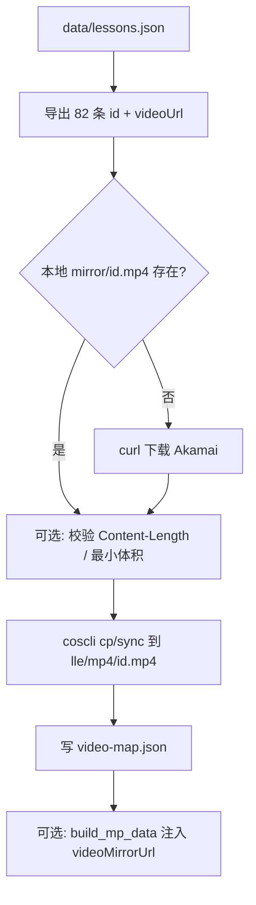
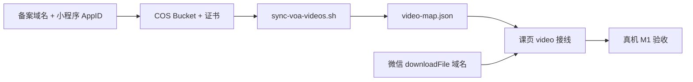

# VOA Let's Learn English · 微信小程序 M1 执行方案（视频可播）

**状态**：阶段 1 方案稿（Composer 只写方案，**禁止**在本 PR 内落地 COS / 改课页业务逻辑）。  
**前置**：`main` 已合 **M0 脚手架**（PR#28）与 [`docs/MP_MIGRATE_PLAN.md`](./MP_MIGRATE_PLAN.md)。  
**范围**：仅 **M1 视频可播**，对照迁移方案 **§D（P0 视频）** 与 **§G（里程碑 M1 行）**。M2 提审、虚拟支付、静态站 H5 行为 **不在本刀**。  
**产品约束**：VOA **必须**以同主体微信小程序上线；幕僚长盯完 M1 验收后再进 M2。

---

## 0. M0 现状（接线起点）

| 项 | 现状 |
| --- | --- |
| 课页 | `miniprogram/packageLessons/lesson/lesson.wxml` 为 **占位卡片**，文案「视频将在 M1 接入」，**无** `<video>` |
| 课 JSON | `build_mp_data.py` 刻意 **不** 写入 `videoUrl` / Akamai；字段 `videoStatus: "m1-placeholder"` |
| 单测 | `js/mp-scaffold.test.js` 断言 catalog / 分课 JSON **不含** akamai、`videoUrl` |
| 免费试学 | 与 H5 一致：`unlock.js` → L1 `number <= 5` 免费；L2 全锁（兑码后全课可开） |

M1 目标：在 **不** 把 Akamai 域名写进小程序包的前提下，课页 `<video>` 使用 **国内镜像 HTTPS 直链**，真机可播、失败有文案。

---

## A. 腾讯云 COS + 已备案域名 + downloadFile 合法域名

分 **运营/用户侧 checklist** 与 **研发侧（仓库 + 小程序后台）** 两条线；密钥与备案由运营在同主体完成，**不进公开仓**。

### A1. 用户侧 / 运营 checklist（幕僚长或 PO 执行）

| # | 动作 | 完成标准 |
| --- | --- | --- |
| 1 | 登录 [腾讯云](https://cloud.tencent.com/)，同 **个体户主体** 开通 **对象存储 COS** | 有可用 Bucket（建议地域：上海/广州，与备案主体一致） |
| 2 | 创建 Bucket，如 `lle-voa-mp4-<随机>`，访问权限 **私有读写** 或 **公有读**（见 A3）；**不要** 开启匿名写 | Bucket 列表可见 |
| 3 | 准备 **已 ICP 备案** 的 HTTPS 域名，如 `media.<同主体已备案主域>` | 备案系统可查；证书可签发 |
| 4 | COS → 域名管理 → **自定义加速域名**，CNAME 到 COS，绑定 **SSL 证书**（腾讯云免费证书即可） | 浏览器访问 `https://media.example.com/` 无证书错误（可先空目录 404） |
| 5 | 在 [微信公众平台](https://mp.weixin.qq.com/) 注册 **VOA 专用新小程序**（不复用木鱼/诗句 AppID） | 拿到 `wx` 开头 AppID |
| 6 | 小程序 → **开发管理 → 开发设置 → 服务器域名** | 见 A2 |
| 7 | 本地安装 **COSCLI** 或配置 **子账号 CAM**（仅 `PutObject`/`GetObject` 到该 Bucket 前缀） | 密钥仅存本机/密码库，**不** 提交 Git |
| 8 | 执行 M1 同步脚本（§B）上传 `lle/mp4/*.mp4` 后，抽查 `lle1-01` 对象可 **HTTPS 直链下载** | `curl -I` 返回 `200` + `Content-Type: video/mp4` |
| 9 | 留存 **域名配置截图** + Bucket 策略说明（供 M1 验收归档） | 可贴 PR / 内部 wiki |

**占位域名**：下文与脚本示例用 `https://media.example.com`；运营替换为真实备案域后，再跑 `sync-voa-videos.sh --base-url`。

### A2. 研发侧：微信后台域名（代码仓外）

| 配置项 | M1 要求 |
| --- | --- |
| **downloadFile 合法域名** | 添加 `media.example.com`（**仅主机名**，无 `https://`、无路径） |
| **request 合法域名** | M1 **可不配**（视频走 `<video src="https://...">` 直链时主要受 downloadFile / 媒体域策略约束；若后续 `wx.request` 拉 `video-map.json` 再配） |
| **uploadFile / socket** | M1 不需要 |
| **业务域名（web-view）** | M1 **不用** web-view |

**真机 vs 开发者工具**

| 环境 | 未配域名 | 已配域名 |
| --- | --- | --- |
| **真机预览 / 体验版** | `<video>` 加载镜像 URL **失败**（预期） | 应可播 |
| **开发者工具** | 默认校验域名 → 失败 | 可播；或勾选「不校验合法域名…」（见 §C3） |

`miniprogram/project.config.json` 的 `appid` 在接正式 AppID 后由运营替换；**AppSecret 永不进仓**（已有 `.gitignore` 覆盖 `project.private.config.json`）。

### A3. COS 对象与权限（建议）

| 项 | 建议 |
| --- | --- |
| 对象键 | `lle/mp4/{lessonId}.mp4`，例 `lle/mp4/lle1-01.mp4` |
| Content-Type | 上传时显式 `video/mp4` |
| 读权限 | **公有读** + CDN 域名（M1 简单）；或私有 + 仅运营本机同步（小程序仍用 **无鉴权 HTTPS 直链** 时需公有读或 CDN 回源公有） |
| 缓存 | CDN 缓存 MP4（`Cache-Control` 可设 7d+）；课内容公版、更新频率低 |
| 费用 | 82 课约 0.5–2 GB 存储；试学 5 课可先控流量（§D） |

### A4. 仓库侧配套（M1 代码 PR，非本方案 PR）

| 文件 | 用途 |
| --- | --- |
| `.gitignore` 增补 | `mirror/`、`*.mp4`、`.cos.yaml`、`.env.cos` 等本地同步产物 |
| `docs/MP_M1_PLAN.md` | 本文 |
| `miniprogram/README.md` | 增加 M1：域名勾选、真机验收、环境变量说明 |

**禁止**：在仓库内提交 SecretId/SecretKey、`.cos.credentials`、含密钥的 CI workflow。

---

## B. `scripts/sync-voa-videos.sh` · 上传 · `video-map.json`

### B1. 设计目标

1. **SSOT**：视频源 URL 仍来自 `data/lessons.json` 的 `videoUrl`（Akamai）；静态站 GitHub Pages **不改**。
2. **增量**：本地 `mirror/mp4/{id}.mp4` 已存在且校验通过则跳过下载；COS 侧用 `coscli sync` 或按 ETag 跳过。
3. **可复现**：生成 `miniprogram/data/video-map.json`（及可选 `mirror/manifest.json` 元数据），供课页与单测读取。
4. **可 CI 校验**：无密钥时 CI 只校验 **map 结构** 与 lessonId 全集；**不** 在 CI 里下载 82 个 MP4。

### B2. 环境变量（仅本机 / 运营机）

```bash
# 示例名；实现时可用 .env.cos（gitignore）
export COS_BUCKET="lle-voa-mp4-xxxxx"
export COS_REGION="ap-shanghai"
export MP_VIDEO_BASE_URL="https://media.example.com"   # 无尾部斜杠
# COSCLI 凭据：~/.cos.yaml 或 COS_SECRET_ID / COS_SECRET_KEY（勿入仓）
```

### B3. 脚本接口（建议）

```bash
scripts/sync-voa-videos.sh [options]

  --dry-run              只打印将下载/上传的课单
  --only lle1-01,lle1-02  仅处理指定 id（试学 5 课用）
  --skip-download        假定 mirror/ 已有，只上传 + 写 map
  --skip-upload          只下载到 mirror/ + 写 map（本地调试）
  --base-url URL         覆盖 MP_VIDEO_BASE_URL
  --mirror-dir PATH      默认 ./mirror/mp4
```

**依赖**：`bash`、`jq`（或 `python3` 读 JSON）、`curl`/`wget`、`coscli`（上传阶段）。

### B4. 流程



### B5. `video-map.json` Schema

路径：**主包** `miniprogram/data/video-map.json`（体量 ≈ 82 条 URL，< 20 KB）。

```json
{
  "version": 1,
  "baseUrl": "https://media.example.com",
  "objectPrefix": "lle/mp4",
  "generatedAt": "2026-09-21T12:00:00+08:00",
  "lessons": {
    "lle1-01": "https://media.example.com/lle/mp4/lle1-01.mp4",
    "lle1-02": "https://media.example.com/lle/mp4/lle1-02.mp4"
  }
}
```

| 规则 | 说明 |
| --- | --- |
| Key | 必须与 `lesson.id` 一致，共 82 个（全量镜像时） |
| URL | 必须 `https://`，主机名 = 微信后台配置的 downloadFile 域 |
| 试学阶段 | `lessons` 可 **仅含 L1 1–5**；未映射课在课页走失败态 + 文案（§C2） |
| 与分课 JSON 关系 | **推荐**：镜像 URL **只** 在 `video-map.json`，分课 JSON 仍无 Akamai；`videoStatus` 改为 `mirror` / `pending` |

### B6. 与 `build_mp_data.py` 的衔接（M1 实现 PR）

| 方案 | 说明 |
| --- | --- |
| **A（推荐）** | 课页 `onLoad`：`const map = require('../../data/video-map.json')` → `map.lessons[lessonId]` |
| **B** | 构建时把 mirror URL **合并**进分课 JSON 字段 `videoMirrorUrl`；需放宽 `FORBIDDEN_SNIPPETS` 仅禁止 akamai 子串 |

单测：对 `video-map.json` 断言 host 不含 `akamai`、试学/全量 id 集合符合当前发布策略。

### B7. `mirror/manifest.json`（可选）

记录每课 `sourceUrl`、`sha256`、`bytes`、`uploadedAt`，便于增量与排障；**不入仓**（gitignore）。

---

## C. 小程序课页 `<video>` · 失败态 · 开发者工具调试

### C1. UI / 逻辑改造点（M1 实现 PR）

| 文件 | 改动 |
| --- | --- |
| `lesson.wxml` | 占位卡片 → `<video id="lessonVideo" src="{{videoSrc}}" controls show-center-play-btn enable-play-gesture object-fit="contain" binderror="onVideoError" bindloadedmetadata="onVideoReady" />` + 失败区 |
| `lesson.wxss` | `.video-wrap` 16:9 容器，与 H5 `lesson.html` 视觉接近 |
| `lesson.js` | `resolveVideoUrl(lessonId)`：查 `video-map.json`；无映射 → `videoSrc=""`，`videoErrorCopy` 展示 |
| `lesson.json` | 如需原生导航栏标题保持不变 |

**播放策略（M1 默认）**

1. **优先 HTTPS 直链** `src="{{videoSrc}}"`（与迁移方案 D2 路径 1 一致）。
2. **不强制** M1 做 `wx.downloadFile` 再播；若真机直链失败且错误码指向域名，先修后台域名，再考虑 downloadFile 二阶段。
3. **不** 在 `src` 使用 `voa-video-ns.akamaized.net`。

### C2. 失败态文案（产品一致、可审核）

| 场景 | 用户可见文案（建议） |
| --- | --- |
| 无 `video-map` 条目（试学未镜像 / 全量未完成） | 「本课视频正在同步到国内线路，请稍后再试。」 |
| 有 URL 但 `binderror`（域名未配、404、网络） | 「视频加载失败。请检查网络；若仅开发者工具失败，请在真机预览或联系客服。」 |
| 兜底 | 展示 `lesson.sourceUrl` 文案链：「也可在浏览器打开 VOA 官网观看（公版）。」**不** 自动 `web-view` 外链 |

状态字段建议：`videoState`: `idle` | `loading` | `playing` | `error` | `unavailable`。

### C3. 开发者工具：「不校验合法域名」

用于 **尚未** 在微信后台配好域名时，本地验证 UI 与事件绑定（**不能** 替代真机验收）。

1. 打开微信开发者工具 → 右上角 **详情**。
2. **本地设置** → 勾选 **「不校验合法域名、web-view（业务域名）、TLS 版本以及 HTTPS 证书」**。
3. 重新编译 → 进入 `lle1-01`：若 COS 已上传且 URL 正确，工具内应可播。
4. **取消勾选** 后应恢复失败（回归用）。
5. `miniprogram/README.md` M1 节须写明：**提审 / 幕僚长验收以真机为准**，工具勾选仅开发便利。

### C4. 可选组件 `video-player`（M1+ polish）

迁移方案 B4 已列；M1 可先在课页内联，M2 前再抽组件。

---

## D. 免费课优先镜像策略

与产品「试学 5 课」及带宽成本对齐（迁移方案 D3）。

| 阶段 | 镜像范围 | 课页行为 |
| --- | --- | --- |
| **D1 冒烟** | `lle1-01` … `lle1-05` | 免费课可播；`lle1-06+` / L2 显示 §C2「同步中」或锁定课仍先付费墙（无视频也不影响锁） |
| **D2 全量** | 82 课全部入 COS + `video-map` 满表 | 已解锁用户任意课可播；未解锁仍只见付费墙，**不** 预载付费课视频 |

**脚本**：`sync-voa-videos.sh --only lle1-01,lle1-02,lle1-03,lle1-04,lle1-05`。

**验收顺序**：先 D1 通过幕僚长真机试学 → 再跑全量同步（运营带宽/存储确认后）。

---

## E. Grok 第一刀范围（M1 实现 PR · 仅仓库内可做）

**目标**：不接 COS 密钥、不假定运营已完成备案，仍交付可合并的 **脚本骨架 + 课页接线 + 单测/文档**。

### E1. 必做

| # | 交付 |
| --- | --- |
| 1 | `scripts/sync-voa-videos.sh`：`--dry-run` / `--only` / 从 `lessons.json` 导出列表 / 下载到 `mirror/mp4/` / 生成 `video-map.json`（**上传 COS 段**用 `coscli` 命令模板 + 检测未配置则 **skip 并 exit 0 提示**） |
| 2 | 提交 **示例** `miniprogram/data/video-map.json`：`lessons` **仅** `lle1-01`–`05`，`baseUrl` 为 `https://media.example.com` 占位（单测用 mock host，真机需运营替换） |
| 3 | `miniprogram/utils/video.js`（或同名）：`getMirrorUrl(lessonId, map)` 纯函数 + 单元测试（`node --test`） |
| 4 | 课页接 `<video>` + §C2 文案；移除「M1 接入」占位卡片 |
| 5 | 更新 `js/mp-scaffold.test.js`：允许 `video-map.json`；分课 JSON 仍 **禁止** akamai；若有 `videoStatus`，断言镜像课为 `mirror` |
| 6 | `.gitignore`：`mirror/`、`*.mp4`、`.env.cos` |
| 7 | `miniprogram/README.md` §M1：域名、工具勾选、试学 5 课路径 |

### E2. 明确不做（Grok 第一刀）

| 项 | 说明 |
| --- | --- |
| COS 密钥 / `coscli` 配置进仓 | 运营本机执行上传 |
| 微信后台改域名 | 运营操作 |
| 修改 `data/lessons.json` 源 `videoUrl` | SSOT 保持 Akamai 给 H5 |
| `wx.requestPayment`、M2 隐私页 | M2 |
| 静态站 `lesson.html` / `js/app.js` 视频逻辑 | 除非文档链接 |
| CI 下载 82 个 MP4 | 体积与版权流程不适合 |

### E3. 建议 PR 标题

`feat(mp): M1 视频镜像接线（video-map + 课页 video + sync 脚本骨架）`

---

## F. 卡死条件与验收标准

### F1. 卡死条件（出现即停，上报幕僚长 / 改方案）

与 [`MP_MIGRATE_PLAN.md` §D4](./MP_MIGRATE_PLAN.md) 一致，M1 特别强调：

| # | 条件 |
| --- | --- |
| 1 | 同主体 **无法在可接受周期内** 完成媒体域 **ICP 备案** + 微信 downloadFile 域名校验 |
| 2 | 腾讯云 **拒绝** 存储/分发 VOA 公版 MP4（以工单为准） |
| 3 | 真机配置域名后 **稳定 404**（对象键或 `baseUrl` 错误且 24h 内无法修复） |
| 4 | 单课 MP4 体积异常（>200MB）导致 COS 或播放不可接受（需单独转码方案） |
| 5 | 产品坚持 **不把任何课** 镜像到国内且又要求小程序内播视频 → 与 D 节结论冲突，只能砍「小程序内视频」或砍上线 |

**非卡死但需决策**：全量 82 课流量成本；可先 D1 再 D2。

### F2. M1 验收标准（对照迁移方案 G 表 M1 行）

| # | 标准 | 验证方式 |
| --- | --- | --- |
| 1 | COS + 自定义域名 + **downloadFile 合法域名** 已配置 | 后台截图 + `curl -I` 一条 MP4 |
| 2 | `sync-voa-videos.sh` 可复现：`video-map.json` 与 Bucket 对象一致 | 同 commit 重跑 `--dry-run` 无意外 diff |
| 3 | **真机**（非仅开发者工具）：`lle1-01` 免费课 **首帧可播、可暂停、可拖进度** | 幕僚长录屏 |
| 4 | 真机：**已兑码解锁** 后随机 **3 节付费课**（如 `lle1-06`、`lle1-20`、`lle2-01`）可完播 | 运营提供测试码；**码不进仓** |
| 5 | 弱网 / 错误 URL：`binderror` 展示 §C2 文案，不白屏、不崩溃 | 开发者工具关域名或改错 host |
| 6 | 仓库 **无** Akamai 字符串进 `miniprogram/` 分课 JSON；`node --test` + `build-mp-data.sh --check` 绿 | CI / 本地 |
| 7 | D1 策略：未镜像课（若仍处试学阶段）提示明确，**不** 静默黑屏 | `lle1-06` 未解锁与未镜像分别可辨 |

### F3. 验收命令（研发）

```bash
# 仓库根
node --test js/study.test.js js/unlock.test.js js/mp-scaffold.test.js js/video.test.js
bash scripts/build-mp-data.sh --check
bash scripts/check-codes-json.sh
bash scripts/sync-voa-videos.sh --dry-run
```

### F4. 交付物（M1 完成后）

- 合并 PR + 运营侧域名截图归档  
- 真机录屏：试学课 + 1 节付费课  
- `video-map.json` 版本与 Bucket `lle/mp4/` 对象列表导出（可贴 manifest）

---

## G. 依赖与顺序



M0（已合）→ **本文档** → Grok M1 代码 PR → 运营上传 + 配域名 → 幕僚长真机验收 → M2 方案/执行。

---

## H. 与静态站 / H5 的关系

| 端 | 视频 URL |
| --- | --- |
| GitHub Pages | 继续 `lessons.json` → Akamai |
| 微信小程序 | `video-map.json` → COS 备案域 |

两端 **Storage 不互通**；视频线路分流，内容 SSOT 仍为同一 `lessons.json` 课 id。

---

**PLAN READY**
