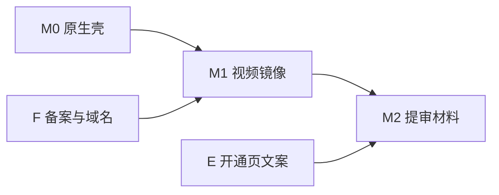

# VOA Let's Learn English · 微信小程序迁移方案（阶段 1）

**状态**：方案稿，供幕僚长审阅后由 Grok 4.6 执行。**本阶段禁止改业务逻辑**（本文档除外）。  
**仓库**：https://github.com/1019666077-bit/wx-extract-mvp（静态站 `main` 已含 PR#26 付费墙修复：空 `codes.json`、`expiresAt`、运营手册）。  
**上线定义**：**必须**以同主体微信小程序提审通过并发布；GitHub Pages 仅作开发预览，**不算正式上线**。

---

## A. 目标形态

### A1. 选型：原生 `mp-weixin`（优先）

| 维度 | 决策 |
| --- | --- |
| 运行时 | **微信原生小程序**（`miniprogram/` 或独立仓 `wx-lle-mp`，编译目标 `mp-weixin`）。WXML + WXSS + Page/Component，逻辑层 TypeScript 或 ES2020+（与团队习惯一致即可）。 |
| 与静态站关系 | **内容源仍为本仓** `data/lessons.json` + 现有 `js/study.js` / `js/unlock.js` 行为规格；小程序侧**重写 UI 与存储适配**，可抽「纯函数模块」与 Node 单测对齐，**不**整站 `web-view` 套壳。 |
| 存储 | `localStorage` → `wx.setStorageSync` / `wx.getStorageSync`（键名保持不变，见 B3）。 |
| 单测 | 继续 `node --test js/study.test.js js/unlock.test.js`；小程序适配层注入 `storage` / `now` 选项（与现有 `createStudy` / `createUnlock` 一致）。 |

### A2. 为何不优先 `web-view` 壳

| 风险 | 说明 |
| --- | --- |
| **业务域名** | `web-view` 只能打开已配置且**ICP 备案**的业务域名；GitHub Pages（`*.github.io`）**不能**作为小程序业务域名。仍需自建已备案 HTTPS 域名 + 改部署，且壳内仍是 H5，审核易被认定为「简单嵌套」。 |
| **视频** | H5 内 `<video src="akamai...">` **不解决**小程序合法域名问题；壳外 `<video>` 同样受 **downloadFile / 媒体域名** 约束。 |
| **支付与审核** | 壳内 H5 收款、跳转外链、混淆「小程序内购买」易触发 **虚拟支付 / 类目** 驳回；与 E 节目标（审慎）冲突。 |
| **体验** | Tab 与原生导航无法与 H5 多页 `index.html` 自然对齐；打卡、错题本、返回栈体验差。 |

**若曾考虑过渡**：仅当 **M0 延误 >2 周** 且已有**同主体已备案域名**托管静态站副本时，可临时用单页 `web-view` 打开「无视频课表预览」——**不得**作为 M2 提审形态，且须单独评估审核驳回风险。**默认路径：不做 web-view 过渡。**

### A3. 工程布局（建议）

```text
wx-extract-mvp/
  data/lessons.json          # 继续为内容 SSOT；CI 校验体积与 schema
  js/study.js                # 逻辑 SSOT（可被 build 复制或 symlink 到 miniprogram/utils/）
  js/unlock.js
  miniprogram/               # 新建：app.json / pages / components / utils/adapters/
  docs/MP_MIGRATE_PLAN.md    # 本文
```

可选：小程序代码量大时拆 **子仓库 + submodule**；M0 建议 **monorepo 子目录**，减少 AppID 与 CI 分叉。

---

## B. 页面映射（静态 HTML → 小程序 pages + tabBar）

### B1. 信息架构

当前站点底部导航（`index.html` 等）四链：**课表 · 打卡 · 错题本 · 开通**。课页 `lesson.html?id=` 为非 Tab 二级页。

### B2. `app.json` 建议

```json
{
  "pages": [
    "pages/index/index",
    "pages/progress/progress",
    "pages/wrongbook/wrongbook",
    "pages/pricing/pricing",
    "pages/lesson/lesson"
  ],
  "tabBar": {
    "color": "#666666",
    "selectedColor": "#1a5fb4",
    "list": [
      { "pagePath": "pages/index/index", "text": "课表" },
      { "pagePath": "pages/progress/progress", "text": "打卡" },
      { "pagePath": "pages/wrongbook/wrongbook", "text": "错题本" },
      { "pagePath": "pages/pricing/pricing", "text": "开通" }
    ]
  },
  "window": {
    "navigationBarTitleText": "Let's Learn English",
    "backgroundTextStyle": "light"
  }
}
```

| 静态页 | 小程序 page | Tab | 路由参数 | 职责摘要 |
| --- | --- | --- | --- | --- |
| `index.html` | `pages/index/index` | 是 | — | 课表、L1/L2 切换、筛选、锁标、首页打卡摘要（可保留或简化为跳转打卡 Tab） |
| `progress.html` | `pages/progress/progress` | 是 | — |  streak、当月网格、与 `study.js` 打卡逻辑一致 |
| `wrongbook.html` | `pages/wrongbook/wrongbook` | 是 | — | 错题列表、再练、`navigateTo` lesson |
| `pricing.html` | `pages/pricing/pricing` | 是 | — | 方案说明、**人工收款说明**、兑换码表单、解锁状态（M0–M2 不接支付 API） |
| `lesson.html` | `pages/lesson/lesson` | 否 | `?id=lle1-01` | 视频区、对话、测验、上一课/下一课（同级内）、付费墙 |

**课表 → 课页**：`wx.navigateTo({ url: '/pages/lesson/lesson?id=' + lessonId })`。

**错题本再练**：同上，带 `id`。

**Tab 角标**：错题数量可仿 `data-wrongbook-count`，在 `wrongbook` 页 `onShow` 时 `setTabBarBadge`（M1+  polish，M0 可省略）。

### B3. 存储键（与静态站 1:1）

| Key | 用途 |
| --- | --- |
| `voa-lle-progress` | 课进度与测验结果 |
| `voa-lle-checkins` | 打卡日期数组（Asia/Shanghai） |
| `voa-lle-wrongbook` | 错题本 |
| `voa-lle-unlock` | 兑换解锁 `{ active, code, plan, unlockedAt, expiresAt }` |

**注意**：小程序 Storage **单 key 上限约 1MB**；当前 JSON 体量远低于此。换机**不同步**（与现站一致，审核文案写清）。

### B4. 组件拆分（M1+，M0 可单页堆叠）

| 组件 | 用途 |
| --- | --- |
| `lesson-card` | 课表卡片 + 锁 |
| `checkin-calendar` | 月历（index 摘要 + progress 完整） |
| `quiz-panel` | 三题测验 |
| `dialogue-list` | 中英对话 |
| `paywall-block` | 锁定态文案 + 跳转开通 Tab |
| `video-player` | 封装 `<video>` + 加载/失败态（M1 起真实地址） |

---

## C. 数据：`lessons.json` 体积与分包 / 按需加载

### C1. 现状（本仓实测）

| 指标 | 数值 |
| --- | --- |
| 文件 | `data/lessons.json` |
| 总体积 | **≈764 KB**（764,178 B） |
| 课数 | **82**（L1×52 + L2×30） |
| 去 `videoUrl` 后 | **≈520 KB** |
| 分 level | `lle1` ≈284 KB，`lle2` ≈245 KB |
| 视频域名 | 82/82 → `voa-video-ns.akamaized.net` |

微信限制（2026 常用口径，以公众平台最新文档为准）：

- **主包** ≤ 2 MB；**单个分包** ≤ 2 MB；**分包总和** ≤ 20 MB（主包+分包总上限约 20 MB 量级）。
- 本课正文 **远低于** 单包上限；瓶颈在 **代码 + 资源 + 是否整包塞视频**（视频**不得**打进包内）。

### C2. 推荐策略（按优先级）

1. **M0–M1（默认）**：主包内放 **catalog 索引 + 按需请求 JSON 切片**  
   - 构建脚本从 `lessons.json` 生成：  
     - `miniprogram/data/catalog.json`（仅 `id, number, title, subtitle, level, lockedPreview`）≈ tens of KB  
     - `miniprogram/data/lessons/lle1-01.json` … 每课一文件（含 dialogue、quiz、**镜像后** `videoUrl`）  
   - 课页 `onLoad`：`require` 或 `wx.request` 读对应课 JSON（同域 CDN 或包内 static 文件）。  
   - **L1/L2 分包（可选）**：  
     - `packageL1/`：L1 课 JSON 或 10 课一组 chunk（每组 ≈31–63 KB，见构建日志）  
     - `packageL2/`：L2 chunk（≈77–84 KB/10 课）  
   - 首屏只加载 catalog，**不**一次 `import` 全量 764 KB。

2. **整包 lessons.json（不推荐）**  
   - 764 KB 虽可塞进主包，但拖慢冷启动、占主包配额；与后续加 UI 资源冲突。

3. **`videoUrl` 维护**  
   - 构建时注入 **国内镜像 URL**（见 D），源 JSON 仍保留 akamai 作 SSOT 便于静态站；小程序 manifest 单独字段 `videoUrlMp` 或构建替换。

### C3. CI / 构建

| 步骤 | 说明 |
| --- | --- |
| `scripts/build-mp-data.sh`（新建） | 校验 schema、课数 82、生成 catalog + 分课或分包 JSON |
| PR 检查 | 单课 JSON 大小告警阈值（如 >150 KB）；`lessons.json` 与生成物 diff 可复现 |
| 与 Pages 关系 | 静态站继续用完整 `data/lessons.json`；小程序用生成物，**单一 SSOT** |

### C4. `codes.json`

小程序 **M0–M2 不接远程 codes 白名单**（与线上一致：空数组 + 格式校验 `LLE-M|Q-*`）。若 M2 后上服务端核销，再改为 `wx.request` 只读接口（**不在本方案 M2 范围**）。

---

## D. P0 视频：Akamai CDN 与小程序合法域名

### D1. 问题陈述

- 现网 MP4：`https://voa-video-ns.akamaized.net/pangeavideo/..._{720p|hq}.mp4`（82 条，VOA 公版源）。  
- 微信小程序 `<video>` / `wx.downloadFile` **仅允许**公众平台配置的 **downloadFile 合法域名**（及媒体相关域名策略）。  
- **Akamai VOA 域名几乎不可能**加入个体户小程序后台（非微信可控、境外 CDN、无备案）。  
- **结论**：不镜像则 **M1 视频不可播**，属 **P0 阻塞**（非 UI 问题）。

### D2. 可行路径（推荐）

**路径 1：国内对象存储 + CDN（推荐）**

| 步骤 | 动作 |
| --- | --- |
| 1 | 选用 **腾讯云 COS**（与微信同属腾讯生态，备案与域名配置文档全）或阿里云 OSS + CDN。 |
| 2 | **一次性或增量同步** 82 个 MP4：源 URL 列表从 `lessons.json` 导出；脚本 `wget/curl` + 上传，对象键建议 `lle/mp4/{lessonId}.mp4`。 |
| 3 | 绑定 **已备案** 自定义域名，如 `https://media.example.com`（同主体 ICP）。 |
| 4 | 小程序后台 → 开发管理 → 服务器域名：**downloadFile 合法域名** 添加 `media.example.com`（**不要**带路径）。 |
| 5 | 课页 `<video src="{{mirrorUrl}}">`；若遇跨域或组件限制，先用 **HTTPS 直链**；失败再 `wx.downloadFile` → 临时路径播放（仍须合法域名）。 |
| 6 | 构建产物写 **镜像 URL**；静态站 GitHub Pages **继续**用 akamai（国内外分流，各端各配）。 |

**成本粗算**：82 课 × 约 5–30 MB/集 ≈ **0.5–2 GB** 存储 + 流量（试学 5 课免费流量可控；全量用户放大需监控）。

**路径 2：经自有后端 302 跳转**

- 小程序请求 **备案域名** 的 `/video?id=`，服务端 302 到 COS 签名 URL。  
- 增加 **服务器开发与运维**；M1 不如路径 1 直链简单。留作 **流量防盗链** 二期。

**路径 3：仅提示「去 VOA 官网观看」+ 小程序内无视频**

- 可通过 **M0 壳**验收，**不满足**产品「看视频学习」与 **M1 验收**；**不可**作为正式上线形态。

### D3. 备选与降级

| 备选 | 适用 | 限制 |
| --- | --- | --- |
| 只镜像 **L1 1–5** 免费课 | 极省存储；付费课锁定无视频 | 付费用户仍要 M1 全量镜像 |
| 音频替代 | 若有 VOA MP3 且可镜像 | 产品变更，需用户确认 |
| 用户复制链接到浏览器 | 合规兜底文案 | 体验差，审核可能问「为何小程序不能播」 |

### D4. 卡死条件（出现即停，改方案或砍 scope）

1. **同主体无法在合理周期内完成** 媒体域名的 **ICP 备案** 与微信域名验证。  
2. COS/CDN **版权或平台政策** 拒绝托管 VOA 公版镜像（低概率，需以服务商反馈为准）。  
3. 微信 **类目** 要求提供「课程版权授权」且无法提供 **非官方自学** 免责声明通过审核（见 F/E）。  
4. 单课 MP4 **超过** 小程序 `<video>` 或本地缓存实践上限（通常单文件数百 MB 才出问题；现 720p 一般可接受）。  
5. **带宽成本** 超出个体户可承受且无试学 gating → 需产品决策（仍非技术卡死，但阻塞「全课视频」）。

### D5. M1 验收（视频）

- 真机：免费课 `lle1-01`、付费课锁定课各 1 节，**首帧可播、可暂停、可完播**。  
- 开发者工具 + 真机：**未配置域名时必失败**（用于回归）。  
- 域名配置截图 + 1 节视频 COS 对象 ACL 私有/公有策略文档化。

---

## E. 付费：虚拟支付、类目、个体户 vs 首发策略

### E1. 现网 MVP（迁移应对齐的行为）

- **无**微信支付 API；**人工**微信转账 + 私聊发码；浏览器 `localStorage` 解锁。  
- 免费：**L1 第 1–5 课**；打卡、错题本免费。  
- 码：`LLE-M-XXXXXX`（30 天）、`LLE-Q-XXXXXX`（90 天）；公开仓 `codes.json` 恒空；格式校验 **非安全**（见 `docs/ops-redeem.md`）。

### E2. 微信小程序审核现实（勿假乐观）

| 话题 | 现实 |
| --- | --- |
| **虚拟支付** | 小程序内售卖「课程解锁」「会员」类 **虚拟商品**，通常需 **开通虚拟支付** 且类目匹配；**iOS 端** 虚拟支付规则更严，常见做法是 **iOS 不展示购买** 或仅用苹果 IAP（本项 **M2 不做**）。 |
| **个体户** | 可注册小程序；部分 **教育/文娱** 类目对企业/个体有 **经营范围** 要求；「非官方 VOA 辅助工具 + 公版内容」需在简介与审核说明中 **写清非官方、不卖 VOA 版权**（与 ops 手册一致）。 |
| **人工转账 + 小程序内兑码** | 审核员可能认定：**规避虚拟支付** 或 **站外交易引导**。比静态 H5 **更敏感**（微信生态内）。 |
| **仅前端兑码** | 与 H5 相同：可被伪造；若审核要求「付费功能说明」，须诚实写 **试用范围**，勿宣称「安全付费系统」。 |

### E3. 审慎路径（与 M2 提审对齐，推荐）

**阶段 M2 默认：「功能完整的学习工具 + 试学 5 课 + 人工开通说明」**

1. **不接** `wx.requestPayment`、不接虚拟支付组件。  
2. **开通 Tab** 文案与现 `pricing.html` 一致：月/季价格、**复制微信号/电话 15232188653**、**客服会话**（若开通 `button open-type="contact"`）说明人工发码。  
3. **兑换码输入** 保留（逻辑移植 `unlock.js`）；与 H5 相同 **格式校验 + 本地 expiresAt**。  
4. **审核备注**（提审表单）：非官方 VOA 公版自学；视频公版；收费仅为 **本站解锁服务**；iOS 若被问支付，说明 **无应用内支付、线下人工**（接受可能被要求 **隐藏价格数字** 或 **仅展示「联系客服解锁」** 的修改）。  
5. **Plan B（若 M2 开通页被驳）**：  
   - 提审版 **隐藏价格与兑码**，仅保留 5 课试学 + 打卡错题；  
   - 开通能力 **仅通过客服消息** 发码（用户小程序 Storage 仍由运营指导粘贴码到隐藏入口或后续版本再加）——需产品接受 **首版弱 monetization**。  
6. **Plan C（真支付）**：单独立项（企业/个体升级、虚拟支付、服务端订单与核销）；**明确不在 Grok M0–M2 范围**（见 I）。

### E4. 与静态站运营衔接

- 发码流程 **不变**：`scripts/gen-codes.py` + 私聊；**禁止** codes 进仓。  
- 小程序解锁状态 **不与 H5 互通**（不同 Storage）；用户换端需重新兑码 — 审核与用户说明写一句即可。

---

## F. AppID、类目、隐私、备案

### F1. 同主体复用 vs 新小程序

| 选项 | 建议 |
| --- | --- |
| **新注册一个小程序**（推荐） | 与已上线 **电子木鱼**、备案中 **诗句对对** 并列；名称如「VOA英语自学」「Let's Learn English 辅助」等（以可注册名为准）。**不要**与木鱼/诗句混在一个 AppID 里。 |
| **主体** | 继续 **同一个体户**；管理员微信、对公收款身份与现运营一致。 |
| AppID 配置 | 新 AppID 的 AppSecret 仅放 CI/本地，**不进公开仓**。 |

### F2. 服务类目（提审前在后台选好）

- 优先方向：**教育 → 在线教育 / 语言学习** 或 **工具 → 信息查询**（以微信当前类目树为准，选 **最接近「语言学习工具」** 且资质要求可满足者）。  
- 避开需 **办学许可证** 的 K12 学科类表述；强调 **自学工具、公版材料、非学历培训**。  
- 若类目要求 **教师资质/平台 ICP** 等无法满足 → 改类目或砍付费表述（联动 E3 Plan B）。

### F3. 隐私与合规

| 项 | 动作 |
| --- | --- |
| **用户隐私保护指引** | 若 **仅本地 Storage、无登录、无上传个人信息**，选「不收集个人信息」或最小化；仍建议提供 **隐私政策** 链接（可托管在同主体已备案域名的静态页）。 |
| **VOA 免责声明** | 每 Tab 底或关于页：非官方、公版、不 affiliated（与现 footer 一致）。 |
| **UGC** | 无；测验答案不上传。 |

### F4. 备案与「诗句对对」并行

| 注意点 | 说明 |
| --- | --- |
| **小程序备案** | 2024 起新小程序需 **小程序备案**（与 ICP 相关联但流程独立）。同一主体可 **多小程序分别备案**；**不会**因为诗句备案中而自动覆盖 VOA 小程序。 |
| **并行冲突** | **人力冲突**：同一运营同时填两套备案表、审核补正；**名称/简介** 勿互相抄袭导致品牌混淆。 |
| **域名** | 若隐私政策、媒体 CDN 用 **新域名**，需 **ICP 备案**（可与诗句站不同子域，同主体备案）。 |
| **web-view** | 若不用 web-view，**不强制**为 GitHub Pages 备国内域名；**媒体域名仍需要**（见 D）。 |

---

## G. 里程碑、人日与验收标准

人日按 **1 名熟悉小程序的前端 + 0.3 名运营/运维（视频镜像与备案）** 估算；不含真支付后端。

| 里程碑 | 目标 | 人日 | 验收标准 |
| --- | --- | --- | --- |
| **M0 可点壳（无视频）** | 原生 Tab + 课表/打卡/错题/开通 + 课页占位；Storage 与逻辑对齐；5 课试学 + 锁 | **4–6** | ① 开发者工具可编译通过 ② 四 Tab 可切换 ③ 课表 82 课展示，L1/L2 切换 ④ 进入 `lle1-01` 对话+测验可提交并写 Storage ⑤ 打卡/错题本与 Node 单测行为一致（抽查 3 条）⑥ 课页视频区显示「M1 接入」占位，**不声称可播** ⑦ 付费课显示锁 + 跳转开通 |
| **M1 视频可播** | COS 镜像 + 域名 + 82 课 `<video>` 可播 | **6–10**（含同步脚本与域名） | ① D2 路径 1 完成，后台域名截图 ② 真机免费课 + 随机 3 节付费课（已解锁态）完播 ③ 弱网/失败有 fallback 文案 ④ 构建流水线可复现镜像 URL 列表 |
| **M2 可提审** | 隐私、关于、审核文案、开通页审慎版、无崩溃 | **4–6** | ① 隐私政策链接可打开 ② 免责声明可见 ③ 开通页符合 E3（无 requestPayment）④ 体验版二维码给运营走查 ⑤ 主包/分包体积在限额内 ⑥ 无测试码、无公开 codes 进包 ⑦ 提审备注按 E3 模板填写 |

**合计**：约 **14–22 人日** 至体验版可提审（M2）；**上线过审** 依赖微信审核周期，**不在人日内承诺**。

### G1. 依赖顺序



---

## H. Grok 4.6 第一刀执行范围（仅 M0 + 脚手架）

**目标**：交付 **可编译、可点击** 的 M0，**不要**一次做完支付、**不要** M1 视频镜像、**不要**改静态站业务行为。

### H1. 必做

1. 新建 `miniprogram/`：`app.json`（含 tabBar）、`app.js`、`app.wxss`、`project.config.json`（`appid` 用占位或本地 `touristappid` 说明文档）。  
2. 五页面骨架：`index` / `progress` / `wrongbook` / `pricing` / `lesson`（参数 `id`）。  
3. `utils/storage.js`：封装 `get/set/remove`，键名与 README 一致。  
4. 移植或 **require 适配** `study.js`、`unlock.js`（CommonJS 导出或在构建时 bundle）；保证 `node --test` 仍绿。  
5. `scripts/build-mp-data.sh` + 首版 **catalog.json + 按课 JSON**（可从全量 lessons 生成；M0 可先 package 内 require 分课文件）。  
6. 课页：**对话 + 测验 + 付费墙** 可用；**视频区占位**（文案：视频将在 M1 接入）。  
7. `docs/MP_MIGRATE_PLAN.md` 若需勘误可小改；另增 `miniprogram/README.md`（如何导入开发者工具、如何跑构建）。  
8. **不修改** `data/lessons.json` 课正文；**不接入** `wx.requestPayment`；**不实现** 服务端核销。

### H2. 明确不做（第一刀）

- COS 同步、域名配置、真机视频  
- 虚拟支付、订单、登录  
- L3 课程  
- web-view 套壳  
- 修改 GitHub Pages 部署或 H5 付费逻辑（除非修复阻塞小程序构建的文档链接）

### H3. 交付物清单

- PR 指向 `main`，标题建议：`docs+chore: 微信小程序 M0 脚手架（无视频）`  
- 录屏：开发者工具内走通「课表 → lle1-01 → 测验 → 打卡 Tab」  
- CI（可选）：`build-mp-data.sh` + `node --test` 在 PR 上跑

---

## I. Won't do（本阶段 / M0–M2 方案边界）

| 项 | 说明 |
| --- | --- |
| **真支付接入** | 不含 `wx.requestPayment`、虚拟支付、苹果 IAP、订单后端 |
| **L3 课** | 不新增 Level 3 内容或爬虫 |
| **海外获客** | 不做 TikTok/独立站 SEO/多语言海外市场方案 |
| **服务端核销 / 一码一用** | 若要做，单独立项，依赖后端 |
| **课正文加密** | 不在小程序方案内 |
| **GitHub Pages 即上线** | 明确拒绝为正式形态 |

---

## 附录：提审备注模板（M2 草稿）

> 本小程序为非官方 VOA Learning English 自学辅助工具。视频与文稿为 VOA 公版材料，本站不提供官方授权证明。用户可免费试学 Level 1 第 1–5 课；打卡与错题本免费。扩展课程通过联系客服线下获取兑换码在本机解锁，**无应用内支付**。数据仅存用户设备，不上传服务器。

---

## 附录：视频同步脚本提纲（M1 执行）

```bash
# 伪代码：执行方在 M1 实现为 scripts/sync-voa-videos.sh
# 1. jq 从 data/lessons.json 导出 id + videoUrl
# 2. 并行下载到 ./mirror/mp4/{id}.mp4
# 3. coscli cp 到 bucket/lle/mp4/
# 4. 生成 miniprogram/data/video-map.json { "lle1-01": "https://media.example.com/lle/mp4/lle1-01.mp4", ... }
```

---

**PLAN READY**
